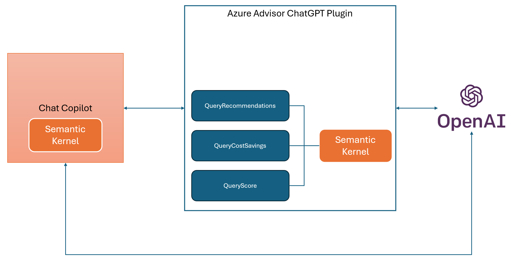

# Azure Advisor ChatGPT plugin

This project demonstrates how to create a ChatGPT plugin using the [Semantic Kernel](https://learn.microsoft.com/en-us/semantic-kernel/overview/) framework. Here is the high level architecture:



- [Chat Copilot](https://github.com/microsoft/chat-copilot) is a sample application demonstrating the usage of the Semantic Kernel. It offers similar user experience as https://chat.openai.com/ and can be configured to either use OpenAI or Azure OpenAI. It is very helpful when it comes to [testing ChatGPT Plugins](https://learn.microsoft.com/en-us/semantic-kernel/chat-copilot/testing-plugins-with-chat-copilot), is free and can be run locally.

- Azure Advisor ChatGPT Plugin offers these operations:

  - **QueryRecommendations** - the most complex operation. It uses this [recommendations API](https://learn.microsoft.com/en-us/rest/api/advisor/recommendations/list?tabs=HTTP) to query Azure Advisor recommendations, extract relevant information, create embeddings using the Azure OpenAI Service, cache them in the [Semantic Kernel Memory](https://learn.microsoft.com/en-us/semantic-kernel/memories/) and run user prompts against this data using the built-in `TextMemorySkill`.
  - **QueryCostSavings** - this operation executes an Azure Resource Graph query to summarize potential cost saving opportunities.
  - **QueryScore** - uses this [score API](https://learn.microsoft.com/en-us/rest/api/advisor/advisor-scores/list?tabs=HTTP) to retrieve Azure Advisor scores per category.

  Every operation requires a `subscriptionId`  and uses a `DefaultAzureCredential` to access Azure Advisor recommendations for this subscription. Make sure to use the [correct credential type](https://learn.microsoft.com/en-us/dotnet/api/azure.identity.defaultazurecredential?view=azure-dotnet) and configure access to your subscription accordingly.

- Azure OpenAI is used to generate completions (`gpt-35-turbo`) and embeddings (`text-embedding-ada-002`). The plugin can be easily reconfigured to use OpenAI directly.

[Semantic Kernel Starter template](https://github.com/microsoft/semantic-kernel-starters/tree/main/sk-csharp-chatgpt-plugin) was used to create this sample. To learn more about using this starter, see the Semantic Kernel documentation that describes how to [create a ChatGPT plugin](https://learn.microsoft.com/en-us/semantic-kernel/ai-orchestration/chatgpt-plugins).

## Demo


## Limitations

Main focus of this experiment was to better understand how to create and test ChatGPT plugins using the Semantic Kernel framework. To save time, some parts of the implementation do not follow best practices (just ran it locally). Known major limitations:

- Chat Copilot runs locally without any authentication and authorization. Use [this guide](https://learn.microsoft.com/en-us/semantic-kernel/chat-copilot/deploy-to-azure#app-registrations-identity) to configure Chat Copilot securely before deploying it anywhere.
- **QueryRecommendations** operation builds up an embeddings cache for a `subscriptionId` but never actually invalidates/refreshes it introducing a potential memory leak. The cache is purged when the process is restarted.
- **QueryRecommendations** - token limit for outbound calls to Azure OpenAI (completion) not being checked.
- It might make sense to use a real vector database. [These databases](https://learn.microsoft.com/en-us/semantic-kernel/memories/vector-db#available-connectors-to-vector-databases) are supported by Semantic Kernel.
- Only subscriptions accessible using plugin's `DefaultAzureCredential` can be queried. To be able to query any subscriptions a user has access to without having to grant access to plugin's identity, e.g. [OAuth plugin authentication](https://platform.openai.com/docs/plugins/authentication/oauth) could be used.
- Lack of authorization. It is essential to make sure that users can access their data only and someone else's data is never exposed to an unauthorized party. To achieve this, use an appropriate [authentication type](https://platform.openai.com/docs/plugins/authentication), as described above, AND also make sure that access to cached information is protected as well. 

I plan on addressing these limitations over time.

## Prerequisites

- You can use this plugin directly through OpenAI ChatGPT  (consider using [ngrok](https://ngrok.com/) if you want to run the plugin locally) or use the [Chat Copilot](https://github.com/microsoft/chat-copilot) application as I did.
- [.NET 6](https://dotnet.microsoft.com/download/dotnet/6.0) is required to run this plugin.
- When using _Visual Studio_
  - Azure Functions Tools. To add Azure Function Tools, include the **Azure development** workload in your Visual Studio installation

- When using _Visual Studio Code_
  - [Azure Functions Core Tools](https://www.npmjs.com/package/azure-functions-core-tools) is required to run this plugin.
  - Install the recommended extensions
    - [C#](https://marketplace.visualstudio.com/items?itemName=ms-dotnettools.csharp)
    - [Semantic Kernel Tools](https://marketplace.visualstudio.com/items?itemName=ms-semantic-kernel.semantic-kernel)


## Configuring the plugin

To configure the plugin, you need to provide the following information:

- Define the properties of the plugin in the [appsettings.json](./azure-function/appsettings.json) file.
- Enter the API key for your AI endpoint in the [local.settings.json](./azure-function/local.settings.json) file.

For Debugging the console application alone, we suggest using .NET [Secret Manager](https://learn.microsoft.com/en-us/aspnet/core/security/app-secrets) to avoid the risk of leaking secrets into the repository, branches and pull requests.


### Using appsettings.json

Configure an OpenAI endpoint

1. Copy [settings.json.openai-example](./config/appsettings.json.openai-example) to `./appsettings.json`
1. Edit the `kernel` object to add your OpenAI endpoint configuration
1. Edit the `aiPlugin` object to define the properties that get exposed in the ai-plugin.json file

Configure an Azure OpenAI endpoint

1. Copy [settings.json.azure-example](./config/appsettings.json.azure-example) to `./appsettings.json`
1. Edit the `kernel` object to add your Azure OpenAI endpoint configuration
1. Edit the `aiPlugin` object to define the properties that get exposed in the ai-plugin.json file

### Using local.settings.json

1. Copy [local.settings.json.example](./azure-function/local.settings.json.example) to `./azure-function/local.settings.json`
1. Edit the `Values` object to add your OpenAI endpoint configuration in the `apiKey` property

## Running the plugin

To run the Azure Functions application just hit `F5`.

To build and run the Azure Functions application from a terminal use the following commands:

```powershell
cd azure-function
dotnet build
cd bin/Debug/net6.0
func host start  
```
